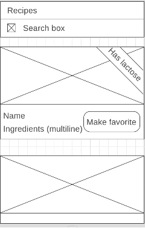

### The challenge

Code challenge Web:
The purpose of this challenge is to assess your skills as a developer. We want you to build a project that is close to what you will do at work and as a Web developer must perform at Badi. The deadline for receiving your challenge is 1 week from the moment you confirm you have received this document​. Ideally, you should have ample time to complete it but in case there are some missing points we would like you to tell us how would you approach them.
We value the following:
- [x] JS code, our web app is built using React, therefore we value your skills on the UI library and the challenge should be completed using it, use the tools that you feel that will help you achieve the goal.
- [x] Project architecture: we care about how the project is architected, mostly because we have an ever-evolving project that needs to be flexible but consistent (component organization, module responsibilities for example).
- [x] Code quality: appropriate data structures and the use of typical programming patterns and good practices.
- [ ] Documentation: We care about explaining the reasoning about decisions and we are thriving to have more and better documentation on our projects.
- [x] Testing: both having tests (Unit, UI, integration, and every kind of test you can imagine) and testable code.
- And last but not least, we want you to reason about your choices. Everyone in our team should be able to defend their opinions and decisions, ie: ​why have you used a certain data structure, which alternatives did you consider, what would you improve if you had more time, etc.​
At the end of the challenge, you must ​deliver your project, with the git files and a text file with all your comments containing your reasonings described in the latest point from above. You should make a zip file and share it to us via email/wetransfer or similar.
The ​project MUST build and run out of the box without us having to do any further adjustments.

<b>The challenge: Build a recipes book</b>
This challenge should be done by using the free to use ​RecipePuppy API​. We would like you to retrieve some recipes from there, display the recipes and perform certain operations on those recipes. Hereby the details:
1. API connection, you should use their search endpoint and perform recipe searches with one or multiple ingredients (​ie: http://www.recipepuppy.com/api/?i=onions,garlic&p=1​) and parse the results.
2. Use a search bar as user input for the first point and show the results when pressing enter and has more than 3 characters​,
3. The results are shown in a list view with a layout like the following. Each recipe should show the image on top, the recipe name, ingredients (this one could have multiple lines so the layouts should support dynamic heights) and a label in a 45% angle that would show only if it contains lactose (to simplify consider that only milk and cheese contain lactose).
4. In a screen wider than 768px, it should show the results on a grid of 2 columns
5. Eachrecipehasan​href​parameter,ieaURLpointingtoawebsitewiththerecipe details. Whenever the user clicks on a recipe using this parameter to open the website.

### Reasoning behind the challenge

First of all, I would have loved to complete more the challenge, but during this process, there are other challenges I need to complete and different timelines I encourage you to visit my GitHub repositories and see more examples of challenges like vanilla js code challenge [metrics-chart](https://github.com/joseaplwork/metric-charts)

* <b>Project structure</b>:
I've implemented the separation of concerns design to separate the models layer, the presentation (components) layer and the controllers(containers) layer. I've chosen the flux architecture with `react-redux`

* <b>Languague</b>:
I've decided to with typescript mainly because it's something I'm learning and using it in a real challenge would improve my knowledge with the language, also because SPAs are evolving and getting more complex and typescript help us to avoid making normal mistakes with un-typed programming languages also it improves development time with more predictable suggestions

* <b>Styling</b>:
I've used the `ITCSS` architecture to structure the styles among the project and followed the BEM convention to style components, objects and utilities

* <b>API</b>:
I've implemented the logic with `redux-sagas` to use  asynchronous actions and attach it to redux flow

* <b>What to improve</b>:
There are many things I can improve if I go in detail but one of the main improvements would be:
_ Adding skeleton preloader to the dogs recipes list to show the user a visual implementation of requesting data
_ Improve is the visual presentation of the challenge I've used a simple design but surely this could be better presented
_ Automate utilities and object classes with the different variants
